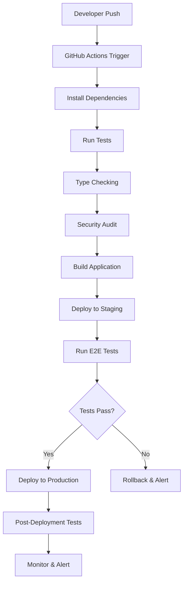

# ALCHM Architecture Documentation

## Table of Contents
- [System Overview](#system-overview)
- [Technology Stack](#technology-stack)
- [Application Architecture](#application-architecture)
- [Data Architecture](#data-architecture)
- [Security Architecture](#security-architecture)
- [Deployment Architecture](#deployment-architecture)
- [Integration Architecture](#integration-architecture)
- [Development Workflow](#development-workflow)
- [Team Onboarding](#team-onboarding)

## System Overview

ALCHM (AI-Powered Life Coaching & Healing Mechanisms) is a trauma-informed journaling OS designed to provide users with AI-powered insights while maintaining strict privacy and security standards. The system combines modern web technologies with advanced AI capabilities to create a therapeutic digital environment.

### Core Mission
- **Trauma-Informed Care**: Designed with therapeutic principles in mind
- **Privacy-First**: User data protection and privacy by design
- **AI-Powered Insights**: Intelligent journaling assistance and emotional analysis
- **Scalable Platform**: Built to handle growth and feature expansion
- **Accessibility**: Inclusive design for all users

### Key Features
- **Secure Journaling**: Encrypted, private journal entries
- **AI Analysis**: Emotional pattern recognition and insights
- **Multi-language Support**: Internationalized interface (en, es, pt, ko, hi, de)
- **Progressive Web App**: Mobile-first responsive design
- **Subscription Management**: Stripe-integrated billing
- **Real-time Sync**: Cross-device synchronization
- **Offline Capability**: PWA offline functionality

## Technology Stack

### Frontend Technologies
```typescript
// Core Framework
Next.js 15 (App Router)          // React framework with SSR/SSG
React 18                         // UI library with concurrent features
TypeScript                       // Type safety and developer experience

// Styling & UI
Tailwind CSS                     // Utility-first CSS framework
Custom Components                // Reusable UI component library
Responsive Design                // Mobile-first approach

// State Management
React Context API                // Global state management
Firebase Auth State              // Authentication state
Local Storage                    // Client-side data persistence

// PWA Features
Service Worker                   // Offline capability
Web App Manifest                 // Install prompts and app behavior
Cache Strategies                 // Intelligent caching for performance
```

### Backend Technologies
```typescript
// Server Platform
Firebase Functions               // Serverless backend functions
Node.js 18                      // JavaScript runtime
Express.js (via Next.js)        // HTTP server framework

// Database
Firestore                       // NoSQL document database
Firebase Storage                // File storage for attachments
Security Rules                  // Database-level access control

// Authentication
Firebase Auth                   // User authentication and management
JWT Tokens                      // Secure session management
Multi-provider Support          // Email, Google, social logins

// External Services
Stripe API                      // Payment processing
Google AI API                   // AI language model integration
Khepera AI                      // Custom AI service integration
```

### Development & DevOps
```bash
# Package Management
pnpm                            # Fast, disk space efficient package manager

# Code Quality
ESLint                          # Code linting and style enforcement
TypeScript Compiler            # Type checking and compilation
Prettier                        # Code formatting

# Testing
Jest                            # Unit testing framework
Playwright                      # End-to-end testing
Firebase Emulators              # Local development environment

# Deployment
Firebase CLI                    # Deployment and management
GitHub Actions                  # CI/CD pipeline
Git                            # Version control
```

## Application Architecture

### High-Level Architecture

```
┌─────────────────────────────────────────────────────────────┐
│                         Users                               │
└─────────────────┬───────────────────────────────────────────┘
                  │
┌─────────────────▼───────────────────────────────────────────┐
│                  CDN / Firebase Hosting                    │
│  ┌─────────────┐ ┌─────────────┐ ┌─────────────────────────┐│
│  │ Static      │ │ Next.js     │ │ Service Worker          ││
│  │ Assets      │ │ App         │ │ (PWA)                   ││
│  └─────────────┘ └─────────────┘ └─────────────────────────┘│
└─────────────────┬───────────────────────────────────────────┘
                  │
┌─────────────────▼───────────────────────────────────────────┐
│              Firebase Functions                             │
│  ┌─────────────┐ ┌─────────────┐ ┌─────────────────────────┐│
│  │ Next.js SSR │ │ API Routes  │ │ Background Functions    ││
│  │ Functions   │ │ (/api/*)    │ │ (Scheduled/Triggered)   ││
│  └─────────────┘ └─────────────┘ └─────────────────────────┘│
└─────────────────┬───────────────────────────────────────────┘
                  │
┌─────────────────▼───────────────────────────────────────────┐
│                    Data Layer                               │
│  ┌─────────────┐ ┌─────────────┐ ┌─────────────────────────┐│
│  │ Firestore   │ │ Firebase    │ │ External APIs           ││
│  │ Database    │ │ Storage     │ │ (Stripe, AI Services)   ││
│  └─────────────┘ └─────────────┘ └─────────────────────────┘│
└─────────────────────────────────────────────────────────────┘
```

### Application Structure

```
src/
├── app/                        # Next.js App Router
│   ├── (auth)/                 # Authentication routes
│   ├── [locale]/               # Internationalized routes
│   ├── admin/                  # Admin panel routes
│   ├── api/                    # API endpoints
│   │   ├── auth/               # Authentication API
│   │   ├── health/             # Health check endpoints
│   │   ├── monitoring/         # Monitoring API
│   │   └── stripe-webhook/     # Payment webhooks
│   ├── globals.css             # Global styles
│   ├── layout.tsx              # Root layout component
│   └── page.tsx                # Home page
├── components/                 # Reusable React components
│   ├── ui/                     # Basic UI components
│   ├── forms/                  # Form components
│   ├── layout/                 # Layout components
│   └── features/               # Feature-specific components
├── lib/                        # Utility libraries
│   ├── firebase.ts             # Firebase client configuration
│   ├── firebaseAdmin.ts        # Firebase admin SDK
│   ├── stripe.ts               # Stripe integration
│   ├── ai.ts                   # AI service integrations
│   ├── analytics.ts            # Analytics tracking
│   ├── errorHandling.ts        # Error management
│   ├── logging.ts              # Logging utilities
│   ├── monitoring.ts           # Performance monitoring
│   └── validateSession.ts      # Authentication validation
├── contexts/                   # React context providers
│   ├── AuthContext.tsx         # Authentication state
│   ├── ThemeContext.tsx        # Theme management
│   └── LocaleContext.tsx       # Internationalization
├── types/                      # TypeScript type definitions
│   ├── auth.ts                 # Authentication types
│   ├── journal.ts              # Journal data types
│   ├── user.ts                 # User data types
│   └── api.ts                  # API response types
└── styles/                     # Styling files
    ├── globals.css             # Global CSS
    └── components.css          # Component-specific styles

functions/                      # Firebase Functions
├── src/
│   ├── index.ts                # Main functions entry point
│   ├── monitoring/             # Monitoring functions
│   ├── auth/                   # Authentication functions
│   └── webhooks/               # External service webhooks
├── package.json                # Function dependencies
└── tsconfig.json               # TypeScript configuration

scripts/                        # Automation scripts
├── production-readiness-master.sh
├── env-audit.sh
├── ssl-domain-audit.sh
├── firebase-audit.sh
├── security-rules-audit.sh
├── production-user-flow-test.sh
├── rollback-deployment.sh
├── setup-monitoring.sh
└── monitor.sh
```

### Component Architecture

```typescript
// Component Hierarchy Example
App Layout
├── Header
│   ├── Navigation
│   ├── UserMenu
│   └── ThemeToggle
├── Main Content
│   ├── Journal Interface
│   │   ├── Editor
│   │   ├── AI Insights
│   │   └── Entry List
│   ├── Dashboard
│   │   ├── Analytics
│   │   ├── Recent Entries
│   │   └── AI Recommendations
│   └── Settings
│       ├── Profile
│       ├── Preferences
│       └── Subscription
└── Footer
    ├── Legal Links
    └── Support Contact
```

## Data Architecture

### Database Schema (Firestore)

```typescript
// User Document Structure
interface User {
  uid: string;                  // Firebase Auth UID
  email: string;               // User email
  profile: {
    displayName?: string;
    avatar?: string;
    timezone: string;
    language: string;
  };
  preferences: {
    theme: 'light' | 'dark' | 'system';
    notifications: boolean;
    aiInsights: boolean;
    privacy: {
      shareAnalytics: boolean;
      shareImprovement: boolean;
    };
  };
  subscription: {
    status: 'free' | 'premium' | 'trial';
    stripeCustomerId?: string;
    currentPeriodEnd?: Timestamp;
    plan?: string;
  };
  createdAt: Timestamp;
  updatedAt: Timestamp;
  lastActive: Timestamp;
}

// Journal Entry Document Structure
interface JournalEntry {
  id: string;
  userId: string;              // Owner reference
  content: string;             // Encrypted journal content
  metadata: {
    wordCount: number;
    characterCount: number;
    estimatedReadTime: number;
  };
  aiAnalysis?: {
    sentiment: 'positive' | 'negative' | 'neutral';
    emotions: string[];
    themes: string[];
    insights: string[];
    confidence: number;
    generatedAt: Timestamp;
  };
  tags: string[];              // User-defined tags
  mood?: {
    rating: number;            // 1-10 scale
    note?: string;
  };
  attachments?: {
    type: 'image' | 'audio' | 'document';
    url: string;
    filename: string;
    size: number;
  }[];
  privacy: {
    encrypted: boolean;
    visibility: 'private' | 'therapist' | 'public';
  };
  createdAt: Timestamp;
  updatedAt: Timestamp;
  archivedAt?: Timestamp;
}

// Session Document Structure
interface Session {
  id: string;
  userId: string;
  device: {
    userAgent: string;
    ip: string;               // Hashed for privacy
    location?: string;        // General location
  };
  authentication: {
    method: 'email' | 'google' | 'social';
    mfaEnabled: boolean;
    lastVerified: Timestamp;
  };
  activity: {
    lastActive: Timestamp;
    pageViews: number;
    actionsCount: number;
  };
  security: {
    suspicious: boolean;
    riskScore: number;
    flags: string[];
  };
  createdAt: Timestamp;
  expiresAt: Timestamp;
}
```

### Database Collections Structure

```
/users/{uid}                    # User profiles and settings
/journals/{uid}/entries/{id}    # User's journal entries (subcollection)
/sessions/{sessionId}           # Active user sessions
/analytics/{uid}/events/{id}    # User analytics data
/subscriptions/{uid}            # Subscription and billing data
/system/health                  # System health monitoring
/monitoring/alerts              # Active system alerts
/errorLogs/{timestamp}          # Application error logs
/auditLogs/{timestamp}          # Security and access logs
```

### Data Security & Privacy

```typescript
// Encryption Strategy
interface EncryptionConfig {
  algorithm: 'AES-GCM-256';
  keyDerivation: 'PBKDF2';
  saltLength: 32;
  ivLength: 12;
  iterations: 100000;
}

// Data Classification
enum DataSensitivity {
  PUBLIC = 'public',           // No encryption needed
  INTERNAL = 'internal',       // Basic encryption
  CONFIDENTIAL = 'confidential', // Strong encryption
  RESTRICTED = 'restricted'     // Highest security + audit trail
}

// Journal Content (RESTRICTED)
// - Encrypted client-side before storage
// - Key derived from user authentication
// - Zero-knowledge architecture

// User Profiles (CONFIDENTIAL)
// - Server-side encryption
// - Encrypted personally identifiable information
// - Access logging and audit trail

// Analytics Data (INTERNAL)
// - Anonymized and aggregated
// - No direct user identification
// - Statistical analysis only
```

## Security Architecture

### Authentication & Authorization

```typescript
// Authentication Flow
interface AuthenticationFlow {
  1: 'User initiates login';
  2: 'Firebase Auth handles authentication';
  3: 'JWT token issued with custom claims';
  4: 'Session document created in Firestore';
  5: 'Client receives secure session cookie';
  6: 'Subsequent requests validated via middleware';
}

// Authorization Levels
enum UserRole {
  USER = 'user',               // Standard user access
  PREMIUM = 'premium',         // Premium feature access
  THERAPIST = 'therapist',     // Healthcare provider access
  ADMIN = 'admin',            // Administrative access
  SYSTEM = 'system'           // System-level access
}

// Permission Matrix
interface Permission {
  resource: string;
  action: 'create' | 'read' | 'update' | 'delete';
  conditions?: {
    ownership?: boolean;
    subscription?: string[];
    timeLimit?: number;
  };
}
```

### Security Rules (Firestore)

```javascript
// Comprehensive Security Rules
rules_version = '2';
service cloud.firestore {
  match /databases/{database}/documents {
    
    // User documents - users can only access their own data
    match /users/{userId} {
      allow read, write: if isAuthenticated() 
        && isOwner(userId)
        && isValidUserData();
    }
    
    // Journal entries - strict ownership and encryption validation
    match /journals/{userId}/entries/{entryId} {
      allow read, write: if isAuthenticated()
        && isOwner(userId)
        && isValidJournalEntry()
        && hasValidEncryption();
        
      allow create: if isAuthenticated()
        && isOwner(userId)
        && isValidJournalEntry()
        && hasValidTimestamp();
    }
    
    // Sessions - system managed with audit trail
    match /sessions/{sessionId} {
      allow read: if isAuthenticated()
        && isSessionOwner(sessionId);
      allow write: if false; // System managed only
    }
    
    // Helper functions
    function isAuthenticated() {
      return request.auth != null && request.auth.uid != null;
    }
    
    function isOwner(userId) {
      return request.auth.uid == userId;
    }
    
    function isValidUserData() {
      return request.resource.data.keys().hasAll(['email', 'createdAt', 'updatedAt'])
        && isValidEmail(request.resource.data.email)
        && isValidTimestamp(request.resource.data.createdAt);
    }
  }
}
```

### Data Protection Measures

```typescript
// Client-Side Encryption
class ClientEncryption {
  private async deriveKey(password: string, salt: Uint8Array): Promise<CryptoKey> {
    const encoder = new TextEncoder();
    const keyMaterial = await crypto.subtle.importKey(
      'raw',
      encoder.encode(password),
      'PBKDF2',
      false,
      ['deriveBits', 'deriveKey']
    );
    
    return crypto.subtle.deriveKey(
      {
        name: 'PBKDF2',
        salt: salt,
        iterations: 100000,
        hash: 'SHA-256'
      },
      keyMaterial,
      { name: 'AES-GCM', length: 256 },
      false,
      ['encrypt', 'decrypt']
    );
  }
  
  async encryptContent(content: string, userKey: string): Promise<EncryptedData> {
    const salt = crypto.getRandomValues(new Uint8Array(32));
    const iv = crypto.getRandomValues(new Uint8Array(12));
    const key = await this.deriveKey(userKey, salt);
    
    const encoder = new TextEncoder();
    const data = encoder.encode(content);
    
    const encrypted = await crypto.subtle.encrypt(
      { name: 'AES-GCM', iv: iv },
      key,
      data
    );
    
    return {
      encrypted: new Uint8Array(encrypted),
      salt: salt,
      iv: iv,
      algorithm: 'AES-GCM-256'
    };
  }
}
```

## Deployment Architecture

### Production Environment

```yaml
# Firebase Hosting Configuration
hosting:
  - site: alchm-production
    public: .next
    cleanUrls: true
    trailingSlash: false
    headers:
      - source: "**"
        headers:
          - key: "X-Frame-Options"
            value: "SAMEORIGIN"
          - key: "X-Content-Type-Options"
            value: "nosniff"
          - key: "Strict-Transport-Security"
            value: "max-age=31536000; includeSubDomains"
    
    rewrites:
      - source: "/api/**"
        function: nextApp
      - source: "**"
        function: nextApp

# Firebase Functions Configuration
functions:
  source: functions
  runtime: nodejs18
  memory: 1GB
  timeout: 60s
  environmentVariables:
    NODE_ENV: production
    FUNCTION_REGION: us-central1
```

### Deployment Pipeline



### Infrastructure as Code

```typescript
// Firebase Configuration
interface FirebaseConfig {
  projectId: string;
  storageBucket: string;
  apiKey: string;
  authDomain: string;
  messagingSenderId: string;
  appId: string;
  measurementId?: string;
}

// Environment Configurations
const environments = {
  development: {
    firebase: devFirebaseConfig,
    stripe: testStripeKeys,
    ai: devAIKeys,
    monitoring: false
  },
  staging: {
    firebase: stagingFirebaseConfig,
    stripe: testStripeKeys,
    ai: prodAIKeys,
    monitoring: true
  },
  production: {
    firebase: prodFirebaseConfig,
    stripe: liveStripeKeys,
    ai: prodAIKeys,
    monitoring: true
  }
};
```

## Integration Architecture

### External Service Integrations

```typescript
// Stripe Payment Integration
interface StripeIntegration {
  purpose: 'subscription_management';
  endpoints: {
    createSubscription: '/api/stripe/create-subscription';
    updateSubscription: '/api/stripe/update-subscription';
    cancelSubscription: '/api/stripe/cancel-subscription';
    webhook: '/api/stripe-webhook';
  };
  security: {
    webhookSignature: 'verified';
    apiKeyRotation: 'quarterly';
    testMode: 'staging_only';
  };
}

// AI Service Integration
interface AIServiceIntegration {
  primary: {
    service: 'Google AI API';
    purpose: 'content_analysis_insights';
    fallback: 'local_sentiment_analysis';
  };
  secondary: {
    service: 'Khepera AI';
    purpose: 'custom_therapeutic_models';
    fallback: 'disable_feature';
  };
  privacy: {
    dataRetention: 'zero_retention';
    anonymization: 'required';
    userConsent: 'explicit';
  };
}

// Analytics Integration
interface AnalyticsIntegration {
  firebase: {
    purpose: 'app_performance_monitoring';
    dataRetention: '14_months';
    userPrivacy: 'ip_anonymization';
  };
  custom: {
    purpose: 'therapeutic_progress_tracking';
    storage: 'firestore_encrypted';
    access: 'user_only';
  };
}
```

### API Design Patterns

```typescript
// RESTful API Structure
interface APIEndpoint {
  path: string;
  method: 'GET' | 'POST' | 'PUT' | 'DELETE';
  authentication: boolean;
  rateLimit: number;
  validation: ValidationSchema;
  response: ResponseSchema;
}

// Example API Endpoints
const apiEndpoints: APIEndpoint[] = [
  {
    path: '/api/journals',
    method: 'GET',
    authentication: true,
    rateLimit: 100, // requests per minute
    validation: PaginationSchema,
    response: JournalListSchema
  },
  {
    path: '/api/journals/{id}',
    method: 'PUT',
    authentication: true,
    rateLimit: 20,
    validation: JournalUpdateSchema,
    response: JournalSchema
  },
  {
    path: '/api/ai/analyze',
    method: 'POST',
    authentication: true,
    rateLimit: 10,
    validation: ContentAnalysisSchema,
    response: AIInsightsSchema
  }
];

// Error Handling Pattern
interface APIResponse<T> {
  success: boolean;
  data?: T;
  error?: {
    code: string;
    message: string;
    details?: any;
  };
  metadata?: {
    timestamp: string;
    requestId: string;
    version: string;
  };
}
```

## Development Workflow

### Git Workflow

```bash
# Branch Strategy
main                    # Production-ready code
├── develop            # Integration branch
├── feature/           # Feature development
│   ├── auth-improvement
│   ├── ai-integration
│   └── ui-redesign
├── hotfix/           # Production fixes
│   └── critical-bug-fix
└── release/          # Release preparation
    └── v1.2.0
```

### Development Process


### Code Quality Standards

```typescript
// ESLint Configuration
{
  "extends": [
    "next/core-web-vitals",
    "@typescript-eslint/recommended",
    "prettier"
  ],
  "rules": {
    "no-console": "warn",
    "prefer-const": "error",
    "@typescript-eslint/no-unused-vars": "error",
    "@typescript-eslint/explicit-function-return-type": "warn"
  }
}

// TypeScript Configuration
{
  "compilerOptions": {
    "strict": true,
    "noImplicitAny": true,
    "noImplicitReturns": true,
    "noFallthroughCasesInSwitch": true,
    "noUncheckedIndexedAccess": true
  }
}

// Testing Requirements
interface TestingStandards {
  unitTestCoverage: '>80%';
  integrationTests: 'required_for_api_changes';
  e2eTests: 'required_for_user_flows';
  performanceTests: 'required_for_optimization';
}
```

## Team Onboarding

### Developer Setup Guide

```bash
# 1. Prerequisites Installation
node --version          # Requires Node.js 18+
npm install -g pnpm    # Package manager
npm install -g firebase-tools  # Firebase CLI

# 2. Repository Setup
git clone <repository-url>
cd alchm
pnpm install

# 3. Environment Configuration
cp .env.local.template .env.local
# Edit .env.local with development credentials

# 4. Firebase Setup
firebase login
firebase use <dev-project-id>

# 5. Local Development
pnpm dev               # Start development server
firebase emulators:start  # Start Firebase emulators

# 6. Verify Setup
npm run test           # Run unit tests
npm run typecheck      # TypeScript validation
npm run lint           # Code linting
```

### Codebase Navigation Guide

```typescript
// Key Files to Understand First
interface OnboardingPath {
  1: {
    file: 'src/app/layout.tsx';
    purpose: 'App structure and global providers';
  };
  2: {
    file: 'src/lib/firebase.ts';
    purpose: 'Firebase client configuration';
  };
  3: {
    file: 'src/components/ui/';
    purpose: 'Reusable UI component library';
  };
  4: {
    file: 'src/app/api/';
    purpose: 'Backend API endpoints';
  };
  5: {
    file: 'firestore.rules';
    purpose: 'Database security configuration';
  };
  6: {
    file: 'functions/src/index.ts';
    purpose: 'Server-side function entry point';
  };
}

// Common Development Tasks
interface DevelopmentTasks {
  addNewPage: {
    location: 'src/app/[new-page]/page.tsx';
    requirements: ['TypeScript', 'responsive design', 'authentication check'];
  };
  createAPIEndpoint: {
    location: 'src/app/api/[endpoint]/route.ts';
    requirements: ['authentication', 'validation', 'error handling'];
  };
  addUIComponent: {
    location: 'src/components/ui/[component].tsx';
    requirements: ['TypeScript props', 'accessibility', 'responsive'];
  };
  modifySecurityRules: {
    location: 'firestore.rules';
    requirements: ['testing in emulator', 'security review', 'documentation'];
  };
}
```

### Debugging & Troubleshooting

```bash
# Common Development Issues

# 1. Firebase Connection Issues
firebase login --reauth
firebase use --clear && firebase use <project-id>

# 2. Build Errors
rm -rf .next node_modules
pnpm install
pnpm build

# 3. Function Deployment Issues
cd functions
rm -rf node_modules lib
pnpm install && pnpm build
cd .. && firebase deploy --only functions

# 4. Database Permission Issues
firebase firestore:rules:get    # Check current rules
firebase emulators:start       # Test rules locally

# 5. Performance Issues
npm run lighthouse             # Performance audit
./scripts/monitor.sh status    # Check system health
```

### Team Resources

```typescript
// Internal Resources
interface TeamResources {
  documentation: {
    architecture: './ARCHITECTURE.md';
    deployment: './DEPLOYMENT_GUIDE.md';
    troubleshooting: './TROUBLESHOOTING_GUIDE.md';
    security: './SECURITY.md';
  };
  
  communication: {
    generalChannel: '#alchm-general';
    developmentChannel: '#alchm-dev';
    alertsChannel: '#alchm-alerts';
    standupTime: 'Daily at 9:00 AM PST';
  };
  
  tools: {
    projectManagement: 'Linear/Jira';
    codeReview: 'GitHub Pull Requests';
    monitoring: 'Firebase Console + Custom Dashboard';
    errorTracking: 'Firebase Crashlytics';
  };
  
  contacts: {
    techLead: 'tech-lead@alchm.com';
    devOps: 'devops@alchm.com';
    security: 'security@alchm.com';
    product: 'product@alchm.com';
  };
}

// External Resources
interface ExternalResources {
  firebase: 'https://firebase.google.com/docs';
  nextjs: 'https://nextjs.org/docs';
  stripe: 'https://stripe.com/docs';
  tailwind: 'https://tailwindcss.com/docs';
  typescript: 'https://www.typescriptlang.org/docs';
}
```

### Learning Path for New Developers

```typescript
// Week 1: Foundation
interface Week1Tasks {
  day1: ['Environment setup', 'Repository walkthrough', 'Run local development'];
  day2: ['Firebase fundamentals', 'Authentication flow', 'Database structure'];
  day3: ['Next.js architecture', 'Component structure', 'Routing system'];
  day4: ['TypeScript patterns', 'Code style guide', 'Testing framework'];
  day5: ['First small feature', 'Code review process', 'Deployment pipeline'];
}

// Week 2: Core Features
interface Week2Tasks {
  day1: ['Journal entry flow', 'Data encryption', 'Security rules'];
  day2: ['AI integration', 'External APIs', 'Error handling'];
  day3: ['Payment integration', 'Subscription management', 'Webhooks'];
  day4: ['Monitoring setup', 'Performance optimization', 'Debugging'];
  day5: ['Feature implementation', 'Testing', 'Documentation'];
}

// Week 3: Advanced Topics
interface Week3Tasks {
  day1: ['Security architecture', 'Privacy implementation', 'Compliance'];
  day2: ['Performance monitoring', 'Error tracking', 'Analytics'];
  day3: ['Deployment strategies', 'Rollback procedures', 'Production debugging'];
  day4: ['Team workflows', 'Code review standards', 'Best practices'];
  day5: ['Independent feature development', 'Full development cycle'];
}
```

### Success Metrics for Onboarding

```typescript
// Onboarding Milestones
interface OnboardingMilestones {
  week1: {
    technical: 'Can run and modify application locally';
    knowledge: 'Understands basic architecture and data flow';
    contribution: 'Makes first small code contribution';
  };
  
  week2: {
    technical: 'Can implement new features with guidance';
    knowledge: 'Understands security and privacy requirements';
    contribution: 'Completes first significant feature';
  };
  
  week3: {
    technical: 'Can work independently on most tasks';
    knowledge: 'Understands deployment and monitoring';
    contribution: 'Leads feature development from design to deployment';
  };
  
  month1: {
    technical: 'Proficient with all major system components';
    knowledge: 'Can troubleshoot production issues';
    contribution: 'Mentors other new team members';
  };
}
```

---

## Quick Reference

### Essential Commands
```bash
# Development
pnpm dev                        # Start development server
firebase emulators:start        # Start Firebase emulators
npm run test                    # Run tests
npm run typecheck              # Type checking

# Production
./scripts/production-readiness-master.sh  # Pre-deployment audit
./deploy-to-production.sh      # Production deployment
./scripts/monitor.sh status    # Check production health
./scripts/rollback-deployment.sh --list  # Available rollbacks
```

### Key URLs
- **Development**: http://localhost:3000
- **Firebase Console**: https://console.firebase.google.com
- **Production**: https://your-domain.com
- **Monitoring**: https://your-domain.com/admin/monitoring

### Emergency Contacts
- **Technical Lead**: [Contact]
- **DevOps**: [Contact]  
- **Security**: [Contact]
- **On-call**: [Emergency Contact]

---

**Document Version**: 1.0.0  
**Last Updated**: $(date)  
**Maintained By**: ALCHM Development Team  
**Next Review**: $(date -d "+6 months" 2>/dev/null || date -v +6m 2>/dev/null)