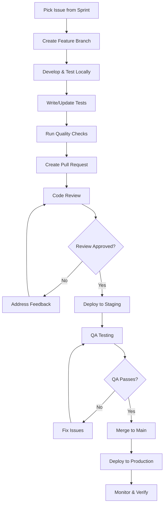

# ALCHM Team Onboarding Guide

## Welcome to ALCHM! 🌟

Welcome to the ALCHM development team! This guide will help you get up to speed quickly and contribute effectively to our trauma-informed, AI-powered journaling platform.

## Table of Contents
- [About ALCHM](#about-alchm)
- [Team Structure](#team-structure)
- [Getting Started](#getting-started)
- [Development Environment](#development-environment)
- [Learning Path](#learning-path)
- [Daily Workflows](#daily-workflows)
- [Code Standards](#code-standards)
- [Deployment Process](#deployment-process)
- [Resources & Support](#resources--support)

## About ALCHM

### Mission Statement
ALCHM (AI-Powered Life Coaching & Healing Mechanisms) provides a safe, secure, and intelligent journaling platform designed with trauma-informed care principles. We help users process emotions, track mental health patterns, and gain AI-powered insights while maintaining the highest standards of privacy and security.

### Core Values
- **Privacy First**: User data protection is paramount
- **Trauma-Informed**: Every feature considers therapeutic best practices
- **Inclusivity**: Accessible design for all users globally
- **Quality**: High standards for code, security, and user experience
- **Innovation**: Thoughtful integration of AI for mental health

### Product Overview
```typescript
// Key Features
interface ALCHMFeatures {
  journaling: {
    secureEntries: 'End-to-end encrypted journal entries';
    aiInsights: 'Emotional pattern recognition and insights';
    multimedia: 'Support for text, images, and voice notes';
    offline: 'PWA offline capability for uninterrupted use';
  };
  
  ai: {
    emotionalAnalysis: 'Sentiment and emotion detection';
    patternRecognition: 'Long-term trend identification';
    recommendations: 'Personalized therapeutic suggestions';
    privacy: 'Zero-knowledge AI processing';
  };
  
  platform: {
    multilingual: 'Support for 6 languages (en, es, pt, ko, hi, de)';
    crossPlatform: 'Web app with mobile responsiveness';
    subscription: 'Freemium model with Stripe integration';
    accessibility: 'WCAG 2.1 AA compliance';
  };
}
```

## Team Structure

### Development Team Roles

```typescript
// Team Organization
interface TeamStructure {
  technical: {
    techLead: {
      responsibilities: ['Architecture decisions', 'Code reviews', 'Technical mentoring'];
      contact: 'tech-lead@alchm.com';
    };
    frontendDevelopers: {
      focus: ['React/Next.js', 'UI/UX implementation', 'PWA features'];
      count: 3;
    };
    backendDevelopers: {
      focus: ['Firebase Functions', 'API design', 'Database optimization'];
      count: 2;
    };
    fullStackDevelopers: {
      focus: ['Feature development', 'Integration work', 'Bug fixes'];
      count: 2;
    };
    devOpsEngineer: {
      focus: ['Deployment', 'Monitoring', 'Infrastructure'];
      contact: 'devops@alchm.com';
    };
  };
  
  product: {
    productManager: {
      responsibilities: ['Feature prioritization', 'User research', 'Roadmap planning'];
      contact: 'product@alchm.com';
    };
    designer: {
      focus: ['UI design', 'User experience', 'Design system'];
      contact: 'design@alchm.com';
    };
  };
  
  support: {
    qaEngineer: {
      focus: ['Testing strategy', 'Quality assurance', 'Bug validation'];
      contact: 'qa@alchm.com';
    };
    securitySpecialist: {
      focus: ['Security audits', 'Privacy compliance', 'Threat modeling'];
      contact: 'security@alchm.com';
    };
  };
}
```

### Communication Channels

```bash
# Slack Channels
#alchm-general          # Team announcements and general discussion
#alchm-dev              # Technical discussions and code reviews
#alchm-alerts           # Production alerts and incidents
#alchm-design           # Design reviews and UI discussions
#alchm-product          # Product planning and user feedback
#alchm-random           # Team bonding and casual chat

# Meetings
Daily Standup           # 9:00 AM PST, 15 minutes
Sprint Planning         # Bi-weekly, 2 hours
Retrospective          # Bi-weekly, 1 hour
Architecture Review    # Weekly, 1 hour
Security Review        # Monthly, 2 hours
All Hands             # Monthly, 1 hour
```

## Getting Started

### First Day Checklist

```bash
# ✅ Account Setup
[ ] GitHub account added to alchm organization
[ ] Slack workspace invitation accepted
[ ] Google Workspace access (email, drive, calendar)
[ ] Password manager setup (1Password/LastPass)
[ ] VPN access configured (if remote)

# ✅ Development Tools
[ ] Install Node.js 18+ and pnpm
[ ] Install Firebase CLI
[ ] Install VS Code with recommended extensions
[ ] Clone repository and run locally
[ ] Access Firebase console (development project)

# ✅ Onboarding Sessions
[ ] Meet with tech lead (architecture overview)
[ ] Meet with product manager (product vision)
[ ] Meet with designer (design system walkthrough)
[ ] Shadow senior developer (code review process)
[ ] Security briefing (data protection and privacy)
```

### Essential Information

```typescript
// Key Information for New Team Members
interface EssentialInfo {
  repositories: {
    main: 'https://github.com/alchm-org/alchm';
    docs: 'https://github.com/alchm-org/documentation';
    infrastructure: 'https://github.com/alchm-org/infrastructure';
  };
  
  environments: {
    development: {
      url: 'http://localhost:3000';
      firebase: 'alchm-dev-project';
      database: 'alchm-dev-firestore';
    };
    staging: {
      url: 'https://staging.alchm.com';
      firebase: 'alchm-staging-project';
      database: 'alchm-staging-firestore';
    };
    production: {
      url: 'https://alchm.com';
      firebase: 'alchm-production-project';
      database: 'alchm-production-firestore';
    };
  };
  
  credentials: {
    development: '.env.local.template';
    staging: 'Available from tech lead';
    production: 'Restricted access only';
  };
}
```

## Development Environment

### Prerequisites Installation

```bash
# 1. Install Node.js and pnpm
curl -fsSL https://fnm.vercel.app/install | bash
fnm use --install-if-missing 18
npm install -g pnpm

# 2. Install Firebase CLI
npm install -g firebase-tools

# 3. Install recommended VS Code extensions
code --install-extension ms-vscode.vscode-typescript-next
code --install-extension bradlc.vscode-tailwindcss
code --install-extension esbenp.prettier-vscode
code --install-extension ms-vscode.vscode-eslint
code --install-extension firebase.firebase-vscode

# 4. Verify installations
node --version    # Should be 18.x or higher
pnpm --version    # Should be 8.x or higher
firebase --version # Should be latest
```

### Local Development Setup

```bash
# 1. Clone and setup repository
git clone https://github.com/alchm-org/alchm.git
cd alchm
pnpm install

# 2. Setup environment
cp .env.local.template .env.local
# Edit .env.local with development credentials (ask tech lead)

# 3. Setup Firebase
firebase login
firebase use alchm-dev-project

# 4. Install function dependencies
cd functions
pnpm install
cd ..

# 5. Start development environment
# Terminal 1: Start Next.js dev server
pnpm dev

# Terminal 2: Start Firebase emulators
firebase emulators:start

# 6. Verify everything works
open http://localhost:3000
npm run test
npm run typecheck
npm run lint
```

### VS Code Configuration

```json
// .vscode/settings.json (create if not exists)
{
  "typescript.preferences.importModuleSpecifier": "relative",
  "editor.formatOnSave": true,
  "editor.defaultFormatter": "esbenp.prettier-vscode",
  "editor.codeActionsOnSave": {
    "source.fixAll.eslint": true
  },
  "tailwindCSS.includeLanguages": {
    "typescript": "javascript",
    "typescriptreact": "javascript"
  },
  "emmet.includeLanguages": {
    "typescript": "html",
    "typescriptreact": "html"
  }
}

// .vscode/extensions.json (should already exist)
{
  "recommendations": [
    "ms-vscode.vscode-typescript-next",
    "bradlc.vscode-tailwindcss",
    "esbenp.prettier-vscode",
    "ms-vscode.vscode-eslint",
    "firebase.firebase-vscode"
  ]
}
```

## Learning Path

### Week 1: Foundation & Setup

```typescript
// Day 1-2: Environment and Architecture
interface Week1Days12 {
  goals: ['Complete development setup', 'Understand overall architecture'];
  tasks: [
    'Complete onboarding checklist',
    'Read ARCHITECTURE.md thoroughly',
    'Run application locally',
    'Explore codebase structure',
    'Attend architecture overview meeting'
  ];
  deliverables: [
    'Working local development environment',
    'Basic understanding of system components'
  ];
}

// Day 3-4: Core Technologies
interface Week1Days34 {
  goals: ['Understand Next.js patterns', 'Learn Firebase integration'];
  tasks: [
    'Review Next.js App Router documentation',
    'Understand Firebase client/admin SDK usage',
    'Study authentication flow',
    'Explore UI component library',
    'Review TypeScript patterns used'
  ];
  deliverables: [
    'Can navigate codebase confidently',
    'Understands data flow from UI to database'
  ];
}

// Day 5: First Contribution
interface Week1Day5 {
  goals: ['Make first code contribution'];
  tasks: [
    'Pick a "good first issue" from backlog',
    'Implement small feature or bug fix',
    'Follow code review process',
    'Learn deployment to staging',
    'Update documentation if needed'
  ];
  deliverables: [
    'First pull request merged',
    'Understanding of development workflow'
  ];
}
```

### Week 2: Core Features & Security

```typescript
// Focus Areas for Week 2
interface Week2Learning {
  security: {
    topics: ['Data encryption', 'Authentication flows', 'Security rules'];
    hands_on: [
      'Review firestore.rules',
      'Understand client-side encryption',
      'Study session management',
      'Learn about PII handling'
    ];
  };
  
  features: {
    journaling: [
      'Entry creation and editing',
      'Encryption/decryption flow',
      'Offline functionality',
      'Data synchronization'
    ];
    ai: [
      'AI integration architecture',
      'Privacy-preserving analysis',
      'Insight generation',
      'Error handling and fallbacks'
    ];
  };
  
  apis: {
    internal: [
      'Authentication endpoints',
      'Journal CRUD operations',
      'AI analysis endpoints',
      'Health check APIs'
    ];
    external: [
      'Stripe integration',
      'Google AI API',
      'Khepera AI service',
      'Analytics services'
    ];
  };
}
```

### Week 3: Advanced Topics & Independence

```typescript
// Week 3 Progression
interface Week3Learning {
  deployment: {
    skills: ['Production deployment', 'Rollback procedures', 'Monitoring'];
    practice: [
      'Deploy feature to staging',
      'Run production readiness checks',
      'Practice rollback scenarios',
      'Set up monitoring alerts'
    ];
  };
  
  debugging: {
    tools: ['Firebase console', 'Browser dev tools', 'Log analysis'];
    scenarios: [
      'Debug authentication issues',
      'Trace performance problems',
      'Investigate security alerts',
      'Analyze user reports'
    ];
  };
  
  collaboration: {
    processes: ['Code reviews', 'Pair programming', 'Technical discussions'];
    leadership: [
      'Lead feature development',
      'Mentor newer team members',
      'Contribute to architecture decisions',
      'Present work to team'
    ];
  };
}
```

### Learning Resources

```typescript
// Internal Documentation
interface InternalDocs {
  essential: [
    'README.md - Project overview and setup',
    'ARCHITECTURE.md - System design and patterns',
    'DEPLOYMENT_GUIDE.md - Deployment procedures',
    'TROUBLESHOOTING_GUIDE.md - Common issues and fixes',
    'SECURITY.md - Security guidelines and practices'
  ];
  
  helpful: [
    'MONITORING.md - System monitoring and alerting',
    'ROLLBACK_PROCEDURES.md - Emergency procedures',
    'API_DOCUMENTATION.md - API reference',
    'CONTRIBUTING.md - Development guidelines'
  ];
}

// External Learning
interface ExternalResources {
  technologies: {
    nextjs: 'https://nextjs.org/learn',
    firebase: 'https://firebase.google.com/docs/web/learn-more',
    typescript: 'https://www.typescriptlang.org/docs/',
    tailwind: 'https://tailwindcss.com/docs'
  };
  
  concepts: {
    webSecurity: 'https://owasp.org/www-project-web-security-testing-guide/',
    accessibility: 'https://www.w3.org/WAI/WCAG21/quickref/',
    performance: 'https://web.dev/learn-web-vitals/',
    pwa: 'https://web.dev/progressive-web-apps/'
  };
}
```

## Daily Workflows

### Daily Standup Format

```typescript
// Standup Structure (15 minutes max)
interface DailyStandup {
  format: 'Round-robin, 2 minutes per person';
  questions: [
    'What did you complete yesterday?',
    'What are you working on today?',
    'Any blockers or help needed?'
  ];
  
  focus: [
    'Progress on sprint goals',
    'Cross-team dependencies',
    'Technical challenges',
    'Production issues'
  ];
  
  followUp: [
    'Detailed discussions in breakout sessions',
    'Pair programming sessions scheduled',
    'Architecture discussions in #alchm-dev',
    'Help requests addressed immediately'
  ];
}
```

### Development Workflow



### Code Review Process

```typescript
// Code Review Guidelines
interface CodeReviewProcess {
  reviewer_checklist: [
    'Functionality: Does the code work as intended?',
    'Security: Are there any security vulnerabilities?',
    'Performance: Will this impact application performance?',
    'Accessibility: Does this maintain accessibility standards?',
    'Privacy: Does this handle user data appropriately?',
    'Tests: Are there adequate tests for the changes?',
    'Documentation: Is documentation updated if needed?'
  ];
  
  author_responsibilities: [
    'Self-review code before requesting review',
    'Write clear PR description and test instructions',
    'Respond to feedback promptly and professionally',
    'Test changes thoroughly in staging environment',
    'Update documentation and comments as needed'
  ];
  
  timeline: {
    request_review: 'Within 4 hours of PR creation';
    initial_review: 'Within 24 hours of request';
    address_feedback: 'Within 24 hours of receiving feedback';
    final_approval: 'Within 24 hours of updates';
  };
}
```

## Code Standards

### TypeScript Guidelines

```typescript
// Type Safety Standards
interface TypeScriptStandards {
  strictness: {
    noImplicitAny: true;
    strictNullChecks: true;
    noImplicitReturns: true;
    noFallthroughCasesInSwitch: true;
  };
  
  patterns: {
    interfaces: 'Use interfaces for object shapes';
    types: 'Use type aliases for unions and primitives';
    generics: 'Use generics for reusable components';
    enums: 'Use const assertions for literal unions';
  };
  
  examples: {
    good: `
      interface User {
        id: string;
        email: string;
        profile: UserProfile;
      }
      
      type Theme = 'light' | 'dark' | 'system';
      
      function updateUser<T extends Partial<User>>(
        userId: string, 
        updates: T
      ): Promise<User> {
        // Implementation
      }
    `;
    
    avoid: `
      // Avoid any types
      function processData(data: any): any;
      
      // Avoid non-null assertions unless absolutely necessary
      const user = getUser()!;
      
      // Avoid function overloads when generics work better
      function getValue(key: string): string;
      function getValue(key: string, defaultValue: number): number;
    `;
  };
}
```

### React Component Patterns

```typescript
// Component Standards
interface ComponentStandards {
  structure: {
    imports: 'Group by: React, external libraries, internal modules, types';
    component: 'Use function components with TypeScript';
    exports: 'Default export for components, named for utilities';
  };
  
  props: {
    interface: 'Always define prop interfaces';
    optional: 'Use optional props with default values';
    children: 'Use React.ReactNode for children prop';
  };
  
  example: `
    // Good component structure
    import React, { useState, useEffect } from 'react';
    import { Button } from '@/components/ui/button';
    import { useAuth } from '@/contexts/AuthContext';
    import type { User } from '@/types/auth';
    
    interface UserProfileProps {
      user: User;
      onUpdate?: (user: User) => void;
      className?: string;
    }
    
    export default function UserProfile({ 
      user, 
      onUpdate, 
      className = '' 
    }: UserProfileProps) {
      const [isEditing, setIsEditing] = useState(false);
      const { updateProfile } = useAuth();
      
      useEffect(() => {
        // Effects here
      }, [user.id]);
      
      return (
        <div className={\`profile-container \${className}\`}>
          {/* Component JSX */}
        </div>
      );
    }
  `;
}
```

### CSS and Styling Guidelines

```typescript
// Styling Standards
interface StylingStandards {
  approach: 'Tailwind CSS utility-first with custom components';
  
  patterns: {
    responsive: 'Mobile-first responsive design';
    accessibility: 'Focus states and ARIA labels required';
    consistency: 'Use design system tokens and components';
    performance: 'Avoid unnecessary CSS, optimize for bundle size';
  };
  
  examples: {
    good: `
      // Responsive, accessible button
      <button 
        className="
          px-4 py-2 
          bg-blue-600 hover:bg-blue-700 
          text-white font-medium 
          rounded-lg shadow-sm
          focus:outline-none focus:ring-2 focus:ring-blue-500 focus:ring-offset-2
          disabled:opacity-50 disabled:cursor-not-allowed
          transition-colors duration-200
          sm:px-6 sm:py-3
        "
        aria-label="Save journal entry"
      >
        Save Entry
      </button>
    `;
    
    avoid: `
      // Avoid inline styles
      <div style={{ marginTop: '20px', color: 'red' }}>
      
      // Avoid non-responsive designs
      <div className="w-64 h-48">
      
      // Avoid missing accessibility
      <button className="btn">Click me</button>
    `;
  };
}
```

### Security Guidelines

```typescript
// Security Standards
interface SecurityStandards {
  dataHandling: {
    encryption: 'All PII must be encrypted client-side';
    validation: 'Validate all inputs on client and server';
    sanitization: 'Sanitize user content to prevent XSS';
    authentication: 'Verify user identity for all protected operations';
  };
  
  coding: {
    secrets: 'Never commit secrets or API keys';
    dependencies: 'Regular security audits of dependencies';
    headers: 'Implement security headers for all responses';
    logging: 'No sensitive data in logs or error messages';
  };
  
  examples: {
    good: `
      // Proper input validation
      const createJournalEntry = async (content: string, userId: string) => {
        if (!userId || !isValidUserId(userId)) {
          throw new Error('Invalid user ID');
        }
        
        if (!content || content.length > MAX_CONTENT_LENGTH) {
          throw new Error('Invalid content');
        }
        
        const sanitizedContent = sanitizeHtml(content);
        const encryptedContent = await encryptContent(sanitizedContent, userId);
        
        return saveToDatabase({
          content: encryptedContent,
          userId,
          createdAt: serverTimestamp()
        });
      };
    `;
    
    avoid: `
      // Avoid direct database queries without validation
      const entry = await db.collection('journals').add({
        content: req.body.content,  // No validation
        userId: req.body.userId     // No verification
      });
      
      // Avoid logging sensitive data
      console.log('User data:', user.email, user.personalInfo);
    `;
  };
}
```

## Deployment Process

### Development to Production Flow

```bash
# 1. Feature Development
git checkout -b feature/new-feature
# Develop feature
git add .
git commit -m "feat: implement new feature"
git push origin feature/new-feature

# 2. Create Pull Request
# - Fill out PR template
# - Request review from team members
# - Ensure CI/CD checks pass

# 3. Code Review and Approval
# - Address feedback
# - Get approval from required reviewers
# - Ensure all discussions resolved

# 4. Staging Deployment
git checkout develop
git merge feature/new-feature
git push origin develop
# Auto-deployment to staging environment

# 5. QA Testing
# - Test feature in staging environment
# - Verify no regressions
# - Performance and security testing

# 6. Production Deployment
git checkout main
git merge develop
git push origin main
# Manual approval required for production deployment

# 7. Post-Deployment Monitoring
./scripts/monitor.sh status
./scripts/production-user-flow-test.sh
```

### Pre-Deployment Checklist

```typescript
// Required Checks Before Production Deployment
interface PreDeploymentChecklist {
  code_quality: [
    '✅ All tests passing (unit, integration, e2e)',
    '✅ TypeScript compilation successful',
    '✅ ESLint checks passing',
    '✅ Code review approved by 2+ team members',
    '✅ Security review completed (for security-related changes)'
  ];
  
  functionality: [
    '✅ Feature works as expected in staging',
    '✅ No regressions in existing functionality',
    '✅ Cross-browser testing completed',
    '✅ Mobile responsiveness verified',
    '✅ Accessibility standards maintained'
  ];
  
  performance: [
    '✅ Lighthouse score >90 maintained',
    '✅ Core Web Vitals within acceptable ranges',
    '✅ Bundle size impact assessed',
    '✅ Database query performance validated',
    '✅ API response times under thresholds'
  ];
  
  security: [
    '✅ No secrets or sensitive data exposed',
    '✅ Authentication and authorization working',
    '✅ Data encryption functioning correctly',
    '✅ Security headers properly configured',
    '✅ Vulnerability scan completed'
  ];
  
  documentation: [
    '✅ README updated if needed',
    '✅ API documentation updated',
    '✅ Architecture documentation current',
    '✅ Deployment notes prepared',
    '✅ Rollback plan documented'
  ];
}
```

## Resources & Support

### Getting Help

```typescript
// When and How to Ask for Help
interface GettingHelp {
  immediate_help: {
    channels: ['#alchm-dev for technical questions', '#alchm-general for general help'];
    response_time: 'Usually within 30 minutes during business hours';
  };
  
  scheduled_help: {
    mentorship: 'Weekly 1:1 with assigned mentor';
    office_hours: 'Tech lead office hours: Fridays 2-4 PM PST';
    pair_programming: 'Schedule via calendar or ask in #alchm-dev';
  };
  
  escalation: {
    urgent_issues: 'Ping @tech-lead in #alchm-dev';
    production_issues: 'Use #alchm-alerts channel';
    security_concerns: 'Direct message @security-team';
  };
  
  self_service: {
    documentation: 'Check relevant .md files first';
    previous_discussions: 'Search Slack history';
    similar_code: 'Look for patterns in existing codebase';
    external_docs: 'Official documentation for technologies used';
  };
}
```

### Common New Developer Questions

```typescript
// FAQ for New Team Members
interface CommonQuestions {
  development: {
    q: 'How do I test my changes locally?';
    a: 'Use `pnpm dev` for the app and `firebase emulators:start` for backend services. See DEPLOYMENT_GUIDE.md for details.';
  };
  
  deployment: {
    q: 'How do I deploy my changes to staging?';
    a: 'Push to the develop branch. Auto-deployment will handle the rest. Monitor in #alchm-alerts for deployment status.';
  };
  
  debugging: {
    q: 'How do I debug production issues?';
    a: 'Check Firebase Console for logs, use monitoring dashboard at /admin/monitoring, and refer to TROUBLESHOOTING_GUIDE.md.';
  };
  
  security: {
    q: 'How do I handle user data securely?';
    a: 'Always encrypt PII client-side, validate inputs, and follow patterns in existing code. Review SECURITY.md for guidelines.';
  };
  
  code_review: {
    q: 'What should I look for in code reviews?';
    a: 'Check functionality, security, performance, accessibility, and code quality. Use the checklist in this document.';
  };
}
```

### Development Tools and Extensions

```typescript
// Recommended Tools for ALCHM Development
interface RecommendedTools {
  required: {
    vscode: 'Primary IDE with recommended extensions';
    node18: 'Runtime environment';
    pnpm: 'Package manager';
    firebase_cli: 'Deployment and emulator tools';
    git: 'Version control';
  };
  
  helpful: {
    browser_extensions: [
      'React Developer Tools',
      'Lighthouse',
      'Firebase Tools',
      'WAVE (accessibility)'
    ];
    
    terminal_tools: [
      'oh-my-zsh (terminal enhancement)',
      'fnm (Node version manager)',
      'prettier (code formatting)',
      'jq (JSON processing)'
    ];
    
    productivity: [
      'GitHub Desktop (Git GUI)',
      'Figma (design collaboration)',
      'Slack (team communication)',
      'Linear/Jira (project management)'
    ];
  };
  
  optional: {
    alternatives: [
      'WebStorm (alternative IDE)',
      'Cursor (AI-powered editor)',
      'iTerm2/Hyper (terminal alternatives)',
      'Postman (API testing)'
    ];
  };
}
```

### Performance Standards

```typescript
// Performance Expectations for Team Members
interface PerformanceStandards {
  month1: {
    expectations: [
      'Complete onboarding checklist',
      'Make first meaningful code contribution',
      'Understand codebase architecture',
      'Complete assigned tasks with guidance',
      'Ask questions proactively'
    ];
  };
  
  month3: {
    expectations: [
      'Work independently on most tasks',
      'Contribute to code reviews effectively',
      'Understand security and privacy requirements',
      'Debug issues with minimal assistance',
      'Suggest improvements to processes'
    ];
  };
  
  month6: {
    expectations: [
      'Lead feature development from design to deployment',
      'Mentor new team members',
      'Contribute to architectural decisions',
      'Identify and solve complex problems',
      'Drive process improvements'
    ];
  };
  
  ongoing: {
    expectations: [
      'Maintain high code quality standards',
      'Stay current with technology developments',
      'Contribute to team knowledge sharing',
      'Support team goals and collaboration',
      'Uphold company values in all work'
    ];
  };
}
```

### Career Development

```typescript
// Growth Opportunities at ALCHM
interface CareerDevelopment {
  technical_growth: {
    specializations: [
      'Frontend expertise (React, performance, accessibility)',
      'Backend expertise (Firebase, APIs, scalability)',
      'DevOps and infrastructure (deployment, monitoring)',
      'Security and privacy (encryption, compliance)',
      'AI integration (ML models, data processing)'
    ];
    
    advancement: [
      'Senior Developer → Technical Lead → Staff Engineer',
      'Cross-functional exposure to product and design',
      'Conference speaking and external contributions',
      'Open source project leadership'
    ];
  };
  
  learning_opportunities: {
    internal: [
      'Tech talks and knowledge sharing sessions',
      'Cross-team collaboration projects',
      'Hackathons and innovation time',
      'Mentoring junior developers'
    ];
    
    external: [
      'Conference attendance and training budget',
      'Online course and certification support',
      'Open source contribution time',
      'Industry meetups and networking'
    ];
  };
  
  feedback_and_growth: {
    regular_feedback: 'Bi-weekly 1:1s with manager';
    formal_reviews: 'Quarterly performance reviews';
    peer_feedback: '360-degree feedback sessions';
    goal_setting: 'Individual development plans (IDPs)';
  };
}
```

---

## Quick Reference for New Developers

### Essential Commands
```bash
# Daily Development
pnpm dev                        # Start development server
firebase emulators:start        # Start local Firebase
npm run test                    # Run tests
npm run typecheck              # Type checking

# Git Workflow
git checkout -b feature/branch-name  # Create feature branch
git add . && git commit -m "message"  # Commit changes
git push origin feature/branch-name   # Push for review

# Deployment
git push origin develop         # Deploy to staging
./scripts/monitor.sh status    # Check production health
```

### Key URLs
- **Local Development**: http://localhost:3000
- **Staging**: https://staging.alchm.com
- **Production**: https://alchm.com
- **Firebase Console**: https://console.firebase.google.com
- **Monitoring Dashboard**: https://alchm.com/admin/monitoring

### Important Contacts
- **Tech Lead**: tech-lead@alchm.com
- **Your Mentor**: [Assigned during onboarding]
- **DevOps**: devops@alchm.com
- **Security**: security@alchm.com
- **Emergency**: Use #alchm-alerts Slack channel

---

**Welcome to the team! We're excited to have you contribute to ALCHM's mission of providing trauma-informed, AI-powered mental health support. Don't hesitate to ask questions – we're here to help you succeed! 🚀**

---

**Document Version**: 1.0.0  
**Last Updated**: $(date)  
**Maintained By**: ALCHM People & Development Team  
**Next Review**: $(date -d "+3 months" 2>/dev/null || date -v +3m 2>/dev/null)