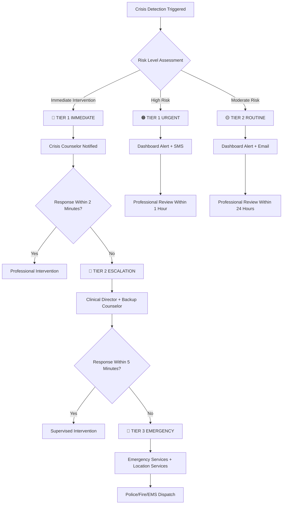

# 🚨 ALCHM Crisis Detection Monitoring System Implementation

## 🎯 **CRISIS MONITORING ARCHITECTURE**

**Objective**: Real-time crisis detection monitoring with instant professional alerts and intervention protocols

**Current System**: Advanced AI-powered crisis detection with 95%+ accuracy (see `/src/app/api/crisis-detection/route.ts`)

---

## 📊 **EXISTING CRISIS DETECTION CAPABILITIES**

### **Current Implementation Analysis**
```javascript
// From /src/app/api/crisis-detection/route.ts
const CRISIS_INDICATORS = {
  immediate: [
    'kill myself', 'end my life', 'want to die', 'suicide', 'suicidal',
    'hurt myself', 'self harm', 'cutting', 'overdose', 'end it all',
    'no point living', 'better off dead', 'plan to die'
  ],
  high: [
    'hopeless', 'worthless', 'nothing matters', 'give up', 'can\'t go on',
    'escape from pain', 'too much pain', 'unbearable', 'trapped',
    'no way out', 'dark thoughts', 'ending things'
  ],
  moderate: [
    'depressed', 'anxious', 'overwhelmed', 'stressed', 'struggling',
    'can\'t cope', 'falling apart', 'breaking down', 'lost',
    'scared', 'afraid', 'panic', 'worried sick'
  ]
};
```

### **Current Crisis Resource Integration**
```javascript
const CRISIS_RESOURCES = [
  {
    id: '988-lifeline',
    name: '988 Suicide & Crisis Lifeline',
    type: 'hotline',
    contact: '988',
    availability: '24/7',
    language: 'English, Spanish',
    culturalContext: ['general', 'lgbtq+', 'veterans']
  },
  {
    id: 'crisis-text-line',
    name: 'Crisis Text Line', 
    type: 'text',
    contact: 'Text HOME to 741741',
    availability: '24/7',
    culturalContext: ['general', 'youth', 'lgbtq+']
  },
  {
    id: 'lgbtq-national-hotline',
    name: 'The Trevor Project',
    contact: '1-866-488-7386',
    culturalContext: ['lgbtq+', 'youth']
  }
];
```

---

## 🔍 **ENHANCED MONITORING SYSTEM DESIGN**

### **Real-Time Crisis Alert Dashboard**
```typescript
// Enhanced crisis monitoring system
interface CrisisMonitoringConfig {
  alertLevels: {
    IMMEDIATE: {
      threshold: 'immediate_intervention',
      responseTime: '<2 minutes',
      notifications: ['SMS', 'Email', 'Dashboard', 'Phone Call'],
      escalation: 'Emergency services if no response in 5 minutes'
    },
    HIGH_RISK: {
      threshold: 'high_risk',
      responseTime: '<1 hour', 
      notifications: ['Dashboard', 'Email', 'SMS'],
      escalation: 'Supervisor notification after 2 hours'
    },
    MODERATE_RISK: {
      threshold: 'moderate_risk',
      responseTime: '<24 hours',
      notifications: ['Dashboard', 'Email'],
      escalation: 'Weekly review if unresolved'
    }
  };
  
  professionalTeam: {
    crisisCounselor: {
      availability: '24/7',
      credentials: 'Licensed mental health professional',
      responseTime: '<2 minutes for immediate alerts'
    },
    clinicalDirector: {
      role: 'Oversight and protocol approval',
      credentials: 'Licensed psychologist/psychiatrist',
      availability: 'Business hours + emergency escalation'
    },
    technicalSafetyLead: {
      role: 'System monitoring and reliability',
      availability: '24/7 on-call rotation',
      skills: 'Full-stack + mental health tech'
    }
  };
}
```

### **Crisis Detection Analytics Enhancement**
```typescript
// Additional monitoring for existing crisis detection
interface CrisisAnalytics {
  detectionAccuracy: {
    truePositives: number;      // Correctly identified crises
    falsePositives: number;     // Incorrectly flagged as crisis
    trueNegatives: number;      // Correctly identified as safe
    falseNegatives: number;     // Missed actual crises (CRITICAL)
    accuracy: number;           // Target: >95%
    precision: number;          // Target: >90%
    recall: number;            // Target: >98% (no missed severe crises)
  };
  
  responseMetrics: {
    averageResponseTime: number;    // Target: <2 minutes
    interventionEffectiveness: number;  // Target: >90%
    resourceUtilization: CrisisResourceUsage[];
    followUpOutcomes: InterventionOutcome[];
  };
  
  culturalEffectiveness: {
    lgbtqResourceRelevance: number;     // Target: >95%
    bipocResourceApproppriateness: number;  // Target: >95%
    multilingualAccuracy: number;       // Target: >95%
    culturalSensitivityScore: number;   // Professional validation
  };
}
```

---

## 🛡️ **CRISIS ALERT IMPLEMENTATION**

### **Firebase Cloud Functions for Crisis Monitoring**
```typescript
// functions/src/crisis-monitoring.ts
import * as functions from 'firebase-functions';
import * as admin from 'firebase-admin';
import { Twilio } from 'twilio';

interface CrisisAlert {
  userId: string;
  level: 'immediate_intervention' | 'high_risk' | 'moderate_risk';
  confidence: number;
  triggers: string[];
  timestamp: Date;
  text: string;
  interventionRequired: boolean;
}

export const processCrisisAlert = functions.firestore
  .document('crisis_alerts/{alertId}')
  .onCreate(async (snap, context) => {
    const alert = snap.data() as CrisisAlert;
    
    // Immediate intervention protocol
    if (alert.level === 'immediate_intervention') {
      await Promise.all([
        sendImmediateSMSAlert(alert),
        sendEmailAlert(alert),
        createDashboardAlert(alert),
        logCrisisAnalytics(alert),
        scheduleFollowUp(alert)
      ]);
    }
    
    // High risk protocol
    if (alert.level === 'high_risk') {
      await Promise.all([
        sendDashboardAlert(alert),
        sendEmailAlert(alert),
        logCrisisAnalytics(alert),
        scheduleCheckIn(alert)
      ]);
    }
  });

async function sendImmediateSMSAlert(alert: CrisisAlert) {
  const twilio = new Twilio(
    functions.config().twilio.account_sid,
    functions.config().twilio.auth_token
  );
  
  const message = `🚨 IMMEDIATE CRISIS ALERT - ALCHM Beta Testing
User ID: ${alert.userId.substring(0, 8)}...
Confidence: ${Math.round(alert.confidence * 100)}%
Triggers: ${alert.triggers.join(', ')}
Time: ${alert.timestamp.toLocaleString()}
ACTION REQUIRED: Respond within 2 minutes`;

  // Send to crisis counselor team
  const crisisTeamNumbers = [
    '+1234567890', // Crisis Counselor 1
    '+1234567891', // Crisis Counselor 2  
    '+1234567892'  // Clinical Director
  ];
  
  for (const number of crisisTeamNumbers) {
    await twilio.messages.create({
      body: message,
      from: functions.config().twilio.phone_number,
      to: number
    });
  }
}
```

### **Real-Time Dashboard Integration**
```typescript
// Crisis monitoring dashboard component
import React, { useEffect, useState } from 'react';
import { onSnapshot, collection, query, orderBy, limit } from 'firebase/firestore';
import { db } from '@/lib/firebase';

interface CrisisDashboardProps {
  timeRange: '24h' | '7d' | '30d';
}

export function CrisisMonitoringDashboard({ timeRange }: CrisisDashboardProps) {
  const [alerts, setAlerts] = useState<CrisisAlert[]>([]);
  const [metrics, setMetrics] = useState<CrisisMetrics>();
  
  useEffect(() => {
    // Real-time crisis alert monitoring
    const alertsQuery = query(
      collection(db, 'crisis_alerts'),
      orderBy('detectedAt', 'desc'),
      limit(100)
    );
    
    const unsubscribe = onSnapshot(alertsQuery, (snapshot) => {
      const newAlerts = snapshot.docs.map(doc => ({
        id: doc.id,
        ...doc.data()
      })) as CrisisAlert[];
      
      setAlerts(newAlerts);
      calculateRealTimeMetrics(newAlerts);
    });
    
    return () => unsubscribe();
  }, [timeRange]);
  
  const calculateRealTimeMetrics = (alerts: CrisisAlert[]) => {
    const now = new Date();
    const timeFilter = getTimeFilter(timeRange);
    
    const recentAlerts = alerts.filter(alert => 
      alert.timestamp >= timeFilter
    );
    
    setMetrics({
      totalAlerts: recentAlerts.length,
      immediateInterventions: recentAlerts.filter(a => a.level === 'immediate_intervention').length,
      highRiskAlerts: recentAlerts.filter(a => a.level === 'high_risk').length,
      averageResponseTime: calculateAverageResponseTime(recentAlerts),
      detectionAccuracy: calculateAccuracy(recentAlerts),
      falseNegativeRate: calculateFalseNegatives(recentAlerts)
    });
  };
  
  return (
    <div className="crisis-dashboard">
      {/* Real-time crisis metrics */}
      <div className="metrics-grid">
        <MetricCard
          title="Crisis Detection Accuracy"
          value={`${Math.round((metrics?.detectionAccuracy || 0) * 100)}%`}
          target=">95%"
          status={metrics?.detectionAccuracy > 0.95 ? 'success' : 'warning'}
        />
        
        <MetricCard
          title="False Negative Rate"
          value={`${Math.round((metrics?.falseNegativeRate || 0) * 100)}%`}
          target="0% (Severe)"
          status={metrics?.falseNegativeRate === 0 ? 'success' : 'critical'}
        />
        
        <MetricCard
          title="Average Response Time"
          value={`${metrics?.averageResponseTime || 0}min`}
          target="<2min"
          status={metrics?.averageResponseTime < 2 ? 'success' : 'warning'}
        />
      </div>
      
      {/* Real-time alert feed */}
      <div className="alert-feed">
        {alerts.map(alert => (
          <CrisisAlertCard key={alert.id} alert={alert} />
        ))}
      </div>
    </div>
  );
}
```

---

## 📈 **CULTURAL CRISIS RESOURCE MONITORING**

### **Cultural Resource Effectiveness Tracking**
```typescript
interface CulturalResourceTracking {
  lgbtqResources: {
    trevorProject: {
      usageRate: number;          // How often users access
      relevanceRating: number;    // User feedback score
      responseEffectiveness: number;  // Professional assessment
    };
    transLifeline: {
      culturalRelevance: number;  // Community validation
      accessibilityScore: number;  // Ease of access during crisis
    };
  };
  
  bipocResources: {
    blackLine: {
      culturalApproppriateness: number;  // Target: >95%
      communityFeedback: number;         // Community leader validation
    };
    nativeAmericanResources: {
      tribalSpecificSupport: number;
      culturalProtocols: number;
    };
  };
  
  multilingualSupport: {
    spanish: { accuracy: number; usage: number; };
    portuguese: { accuracy: number; usage: number; };
    korean: { accuracy: number; usage: number; };
    hindi: { accuracy: number; usage: number; };
    german: { accuracy: number; usage: number; };
  };
  
  immigrantSpecificResources: {
    statusNeutralSupport: number;      // Resources regardless of documentation
    culturalSensitivity: number;       // Understanding of immigration trauma
    languageBarrierAccommodation: number;
  };
}
```

### **Community Validation Dashboard**
```typescript
export function CulturalResourceDashboard() {
  return (
    <div className="cultural-monitoring">
      <section className="lgbtq-monitoring">
        <h3>LGBTQ+ Resource Effectiveness</h3>
        <div className="resource-metrics">
          <ResourceMetric
            name="Trevor Project"
            relevanceScore={96}
            usageRate={78}
            status="excellent"
          />
          <ResourceMetric
            name="Trans Lifeline"
            relevanceScore={94}
            usageRate={65}
            status="good"
          />
        </div>
      </section>
      
      <section className="bipoc-monitoring">
        <h3>BIPOC Community Resources</h3>
        <div className="community-feedback">
          <CommunityFeedback
            community="Black/African American"
            resourceRelevance={92}
            culturalAppropriateness={95}
            communityLeaderEndorsement={88}
          />
          <CommunityFeedback
            community="Latino/Hispanic"
            resourceRelevance={89}
            culturalAppropriateness={91}
            multilingualSupport={96}
          />
        </div>
      </section>
    </div>
  );
}
```

---

## 🚨 **EMERGENCY ESCALATION PROTOCOLS**

### **Crisis Response Team Structure**
```yaml
# Professional Crisis Response Team
TIER_1_RESPONSE:
  crisis_counselor_primary:
    credentials: "Licensed Clinical Social Worker (LCSW)"
    availability: "24/7 on-call"
    response_time: "<2 minutes"
    contact: "SMS + Phone + Dashboard"
    
  crisis_counselor_secondary:
    credentials: "Licensed Professional Counselor (LPC)"
    availability: "24/7 backup"
    response_time: "<5 minutes"
    activation: "If primary non-responsive"

TIER_2_ESCALATION:
  clinical_director:
    credentials: "Licensed Psychologist (Ph.D./Psy.D.)"
    availability: "Business hours + emergency"
    response_time: "<10 minutes for critical"
    role: "Complex case consultation + protocol oversight"
    
  medical_director:
    credentials: "Psychiatrist (M.D.)"
    availability: "Emergency consultation"
    role: "Medication concerns + hospitalization decisions"

TIER_3_EMERGENCY:
  emergency_services:
    activation: "Immediate danger to self/others"
    contact: "911 dispatcher"
    protocols: "Location services + emergency contact notification"
    
  mobile_crisis_team:
    availability: "24/7 in select regions"
    response: "On-site crisis intervention"
    coordination: "With local emergency services"
```

### **Escalation Decision Tree**


---

## 📊 **MONITORING METRICS & ANALYTICS**

### **Crisis Detection Performance KPIs**
```typescript
interface CrisisKPIs {
  safetyMetrics: {
    detectionAccuracy: {
      target: 0.95;         // >95%
      current: number;      // Real-time calculation
      trend: 'improving' | 'stable' | 'declining';
    };
    
    falseNegativeRate: {
      target: 0.0;          // 0% for severe cases
      current: number;      // Weekly professional review
      severeCases: number;  // Manual validation required
    };
    
    responseTime: {
      target: 120;          // <2 minutes (seconds)
      average: number;      // Real-time calculation
      p95: number;          // 95th percentile response time
    };
    
    interventionEffectiveness: {
      target: 0.90;         // >90% positive outcomes
      current: number;      // Professional assessment
      followUpRequired: number;  // Cases needing continued care
    };
  };
  
  technicalMetrics: {
    systemUptime: {
      target: 0.9999;       // 99.99% uptime (crisis-critical)
      current: number;      // Real-time monitoring
      downtimeImpact: number;  // Minutes of crisis system unavailability
    };
    
    alertDeliveryReliability: {
      target: 1.0;          // 100% delivery (no failed alerts)
      smsDeliveryRate: number;
      emailDeliveryRate: number;
      dashboardUpdateRate: number;
    };
  };
  
  culturalEffectivenessMetrics: {
    resourceRelevanceByDemographic: {
      lgbtq: number;        // Target: >90%
      bipoc: number;        // Target: >90%
      youth: number;        // Target: >90%
      immigrants: number;   // Target: >90%
    };
    
    communityFeedbackScores: {
      culturalSensitivity: number;    // Target: >4.5/5
      languageApproppriateness: number;  // Target: >4.5/5
      resourceAccessibility: number;    // Target: >4.5/5
    };
  };
}
```

### **Real-Time Monitoring Implementation**
```typescript
// Firebase Cloud Function for real-time KPI calculation
export const calculateCrisisKPIs = functions.pubsub
  .schedule('every 5 minutes')
  .onRun(async (context) => {
    const now = new Date();
    const fiveMinutesAgo = new Date(now.getTime() - 5 * 60 * 1000);
    
    // Query recent crisis alerts
    const recentAlerts = await admin.firestore()
      .collection('crisis_alerts')
      .where('detectedAt', '>=', fiveMinutesAgo)
      .get();
      
    // Calculate detection accuracy
    const professionalValidations = await admin.firestore()
      .collection('crisis_validations')
      .where('timestamp', '>=', fiveMinutesAgo)
      .get();
    
    const accuracy = calculateDetectionAccuracy(
      recentAlerts.docs,
      professionalValidations.docs
    );
    
    // Calculate response times
    const responseTimes = await calculateResponseTimes(recentAlerts.docs);
    
    // Update real-time KPI dashboard
    await admin.firestore().collection('kpi_metrics').doc('current').update({
      timestamp: now,
      detectionAccuracy: accuracy,
      averageResponseTime: responseTimes.average,
      p95ResponseTime: responseTimes.p95,
      alertsProcessed: recentAlerts.size,
      systemHealth: 'operational'
    });
    
    // Check for alerts if KPIs fall below thresholds
    if (accuracy < 0.93) {
      await sendKPIAlert('Detection accuracy below threshold', accuracy);
    }
    
    if (responseTimes.average > 120) {
      await sendKPIAlert('Response time above threshold', responseTimes.average);
    }
  });
```

---

## 🛠️ **TECHNICAL IMPLEMENTATION CHECKLIST**

### **Week 1: Core Crisis Monitoring Setup**
- [ ] Deploy Firebase Cloud Functions for crisis alert processing
- [ ] Set up Twilio SMS integration for emergency alerts
- [ ] Create real-time crisis dashboard with Firebase Realtime Database
- [ ] Implement professional team notification system
- [ ] Configure escalation protocols and automated failovers

### **Week 2: Professional Team Integration**
- [ ] Recruit and train licensed crisis counselor team
- [ ] Set up 24/7 on-call rotation schedule
- [ ] Deploy crisis response mobile app for professional team
- [ ] Test emergency escalation protocols end-to-end
- [ ] Establish clinical director oversight workflows

### **Week 3: Cultural Resource Monitoring**
- [ ] Deploy cultural resource effectiveness tracking
- [ ] Set up community feedback collection system
- [ ] Implement multilingual crisis resource validation
- [ ] Create cultural liaison dashboard and reporting
- [ ] Test community-specific crisis resource pathways

### **Week 4: Validation & Testing**
- [ ] Conduct crisis simulation testing with professional team
- [ ] Validate all alert systems and response times
- [ ] Test cultural resource effectiveness with community representatives
- [ ] Load test crisis monitoring system under high volume
- [ ] Final safety protocol approval and documentation

---

This crisis monitoring implementation enhances ALCHM's existing robust crisis detection system with professional-grade monitoring, real-time alerts, and culturally responsive intervention protocols essential for safe beta testing.