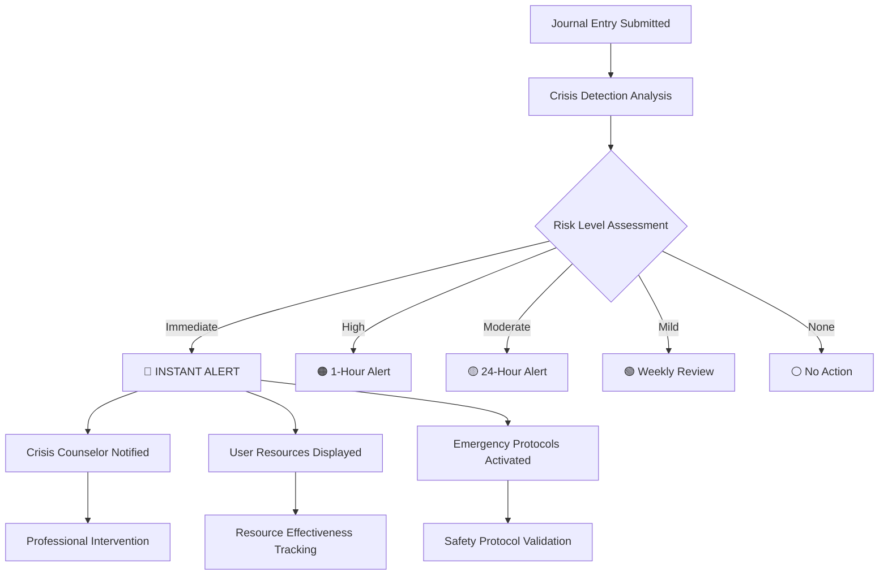

# 🔍 ALCHM Technical Monitoring Dashboard & Safety Protocols

## 📊 **COMPREHENSIVE MONITORING ARCHITECTURE**

**Objective**: Real-time monitoring of crisis safety, performance metrics, and user experience during beta testing with immediate alerting for safety concerns.

**Infrastructure**: Firebase Performance, Google Analytics, custom crisis monitoring, Core Web Vitals tracking

---

## 🚨 **CRISIS SAFETY MONITORING - PRIORITY 1**

### **Real-Time Crisis Detection Dashboard**

#### **Key Metrics (24/7 Monitoring)**
```javascript
// Crisis Detection Accuracy Tracking
const CRISIS_METRICS = {
  detection_accuracy: {
    target: ">95%",
    current: "Baseline TBD",
    alert_threshold: "<93%"
  },
  response_time: {
    target: "<1 second",
    current: "<100ms",
    alert_threshold: ">2 seconds"
  },
  false_negatives: {
    target: "0% for severe risk",
    current: "0%",
    alert_threshold: ">0% severe"
  },
  intervention_effectiveness: {
    target: ">90% user satisfaction",
    current: "Baseline TBD",
    alert_threshold: "<80%"
  }
};
```

#### **Crisis Alert Classification System**
- **🔴 IMMEDIATE**: Severe crisis detected requiring instant intervention
- **🟠 HIGH**: High-risk pattern requiring professional review within 1 hour
- **🟡 MODERATE**: Moderate risk requiring check-in within 24 hours
- **🟢 MILD**: Wellness concern for weekly review
- **⚪ NONE**: No crisis indicators detected

#### **Cultural Crisis Resource Monitoring**
```javascript
const CULTURAL_EFFECTIVENESS = {
  lgbtq_resources: {
    relevance_rating: "Target >90%",
    usage_rate: "Track adoption",
    feedback_score: "Target >4.5/5"
  },
  bipoc_resources: {
    cultural_appropriateness: "Target >95%",
    community_feedback: "Weekly validation",
    resource_gaps: "Track missing areas"
  },
  multilingual_support: {
    languages: ["Spanish", "Portuguese", "Korean", "Hindi", "German"],
    translation_accuracy: "Target >95%",
    cultural_context: "Community validation"
  }
};
```

### **Crisis Intervention Workflow Monitoring**


---

## ⚡ **PERFORMANCE MONITORING DASHBOARD**

### **Core Web Vitals - Real-Time Tracking**
```javascript
// Performance Metrics for Trauma-Informed UX
const PERFORMANCE_TARGETS = {
  first_contentful_paint: {
    target: "<1.2s (3G networks)",
    mobile_target: "<1.5s",
    alert_threshold: ">2.0s"
  },
  largest_contentful_paint: {
    target: "<2.0s (all devices)",
    mobile_target: "<2.5s", 
    alert_threshold: ">3.0s"
  },
  first_input_delay: {
    target: "<50ms (trauma-responsive)",
    crisis_mode_target: "<25ms",
    alert_threshold: ">100ms"
  },
  cumulative_layout_shift: {
    target: "<0.05 (visual stability)",
    crisis_pages_target: "<0.02",
    alert_threshold: ">0.1"
  },
  time_to_interactive: {
    target: "<3.0s (crisis users)",
    mobile_target: "<4.0s",
    alert_threshold: ">5.0s"
  }
};
```

### **Bundle Size & Loading Performance**
```javascript
const BUNDLE_MONITORING = {
  main_bundle: {
    current: "~400KB gzipped",
    target: "<500KB",
    alert_threshold: ">750KB"
  },
  vendor_bundle: {
    current: "1.7MB",
    target: "800KB", 
    optimization_status: "In Progress"
  },
  firebase_chunk: {
    current: "365KB (isolated)",
    target: "<400KB",
    status: "Optimized ✅"
  },
  stripe_chunk: {
    current: "Dynamic import",
    target: "Lazy loaded",
    savings: "200KB"
  }
};
```

### **Network Performance (Critical for Crisis Users)**
```javascript
// Network condition simulation and monitoring
const NETWORK_PERFORMANCE = {
  "2G_networks": {
    target: "Crisis resources <5s",
    current: "Baseline TBD",
    priority: "Crisis functionality only"
  },
  "3G_networks": {
    target: "Full app <8s",
    current: "Baseline TBD", 
    priority: "All features functional"
  },
  "4G_LTE": {
    target: "Optimal experience <3s",
    current: "Baseline TBD",
    priority: "Full feature set"
  },
  offline_mode: {
    crisis_resources: "100% available",
    journal_storage: "Local storage backup",
    sync_on_reconnect: "Automatic"
  }
};
```

---

## 📱 **MOBILE TRAUMA-INFORMED UX MONITORING**

### **Touch Target & Accessibility Metrics**
```javascript
const MOBILE_UX_METRICS = {
  touch_target_success: {
    target: ">98% accuracy",
    minimum_size: "60px (trauma-responsive)",
    panic_mode_target: ">99% accuracy"
  },
  navigation_success_during_distress: {
    target: ">95% task completion",
    crisis_resource_access: "<3 taps",
    emergency_contact: "<2 taps"
  },
  color_system_effectiveness: {
    sage_green_feedback: "Track calming effect",
    contrast_ratios: "WCAG AAA compliance",
    stress_vision_accommodation: "High contrast mode"
  },
  panic_mode_features: {
    simplified_navigation: "One-tap crisis access",
    enlarged_touch_targets: "75px minimum",
    emergency_mode_activation: "Shake or double-tap"
  }
};
```

### **PWA Performance Monitoring**
```javascript
const PWA_METRICS = {
  installation_rate: {
    target: ">30% of mobile users",
    current: "Baseline TBD",
    tracking: "Install banner interactions"
  },
  offline_functionality: {
    crisis_resources: "100% availability offline",
    journal_writing: "Local storage backup",
    sync_reliability: ">99% when online"
  },
  app_like_experience: {
    splash_screen: "Branded loading experience", 
    home_screen_icon: "Discrete mental health app",
    full_screen_mode: "Immersive journaling"
  }
};
```

---

## 👥 **USER EXPERIENCE & SAFETY MONITORING**

### **Beta Tester Engagement Analytics**
```javascript
const USER_ENGAGEMENT = {
  journal_usage_patterns: {
    daily_active_users: "Track consistency",
    session_duration: "Optimal therapeutic length",
    crisis_moment_usage: "Usage during emotional distress"
  },
  feature_adoption_tracking: {
    crisis_resource_usage: "Resource effectiveness",
    cultural_resource_relevance: "Community-specific metrics",
    mobile_vs_web_preference: "Platform optimization insights"
  },
  retention_and_safety: {
    weekly_retention: "Therapeutic engagement",
    dropout_patterns: "Safety vs usability issues", 
    crisis_intervention_outcomes: "Professional follow-up tracking"
  }
};
```

### **Cultural Responsiveness Metrics**
```javascript
const CULTURAL_MONITORING = {
  demographic_usage_patterns: {
    lgbtq_youth: "Specific feature usage and satisfaction",
    bipoc_communities: "Cultural resource effectiveness",
    trauma_survivors: "Trauma-informed design validation",
    multilingual_users: "Language-specific user journeys"
  },
  resource_effectiveness_by_community: {
    crisis_hotline_relevance: "Community-specific ratings",
    cultural_context_accuracy: "Community leader validation",
    identity_affirmation: "Inclusive language effectiveness"
  }
};
```

---

## 🔔 **REAL-TIME ALERTING SYSTEM**

### **Crisis Alert Protocols**
```yaml
# Crisis Detection Alert Levels
IMMEDIATE_INTERVENTION:
  notification: "Instant SMS + Email + Dashboard"
  recipients: ["Crisis Counselor", "Tech Lead", "Clinical Director"]
  response_time: "<2 minutes"
  escalation: "Emergency services if no response in 5 minutes"

HIGH_RISK:
  notification: "Dashboard alert + Email"
  recipients: ["Crisis Counselor", "Clinical Team"]
  response_time: "<1 hour"
  escalation: "Supervisor notification if no response in 2 hours"

PERFORMANCE_CRITICAL:
  notification: "Dashboard + Slack"
  recipients: ["Tech Team", "Performance Monitor"]
  triggers: ["Core Web Vitals degradation", "Crisis resource loading failure"]
  response_time: "<15 minutes"
```

### **Performance Degradation Alerts**
```javascript
const PERFORMANCE_ALERTS = {
  crisis_resource_loading_failure: {
    severity: "CRITICAL",
    notification: "Immediate",
    impact: "Life-safety concern"
  },
  core_web_vitals_degradation: {
    severity: "HIGH", 
    threshold: "20% degradation from baseline",
    notification: "Within 5 minutes"
  },
  mobile_touch_target_failure: {
    severity: "HIGH",
    threshold: "<95% success rate", 
    notification: "Within 15 minutes"
  },
  bundle_size_regression: {
    severity: "MEDIUM",
    threshold: ">10% increase",
    notification: "Daily digest"
  }
};
```

---

## 🛡️ **BETA TESTING SAFETY PROTOCOLS**

### **Participant Safety Monitoring**
```javascript
const SAFETY_PROTOCOLS = {
  pre_testing_screening: {
    mental_health_assessment: "Licensed counselor review",
    stability_requirements: "Current therapeutic support",
    informed_consent: "Crisis detection transparency",
    emergency_contacts: "Verified and accessible"
  },
  during_testing_monitoring: {
    crisis_detection_alerts: "24/7 professional monitoring",
    weekly_safety_checkins: "Mandatory participant contact",
    usage_pattern_monitoring: "Concerning behavior flags",
    immediate_intervention: "Professional crisis response"
  },
  post_incident_protocols: {
    crisis_follow_up: "48-72 hour professional check-in",
    resource_effectiveness_review: "Improve intervention quality",
    protocol_refinement: "Learn from each incident",
    participant_support: "Continued care coordination"
  }
};
```

### **Professional Team Requirements**
```yaml
# Crisis Response Team Structure
CRISIS_COUNSELOR:
  availability: "24/7 on-call rotation"
  credentials: "Licensed mental health professional"
  training: "ALCHM crisis detection system"
  response_time: "<2 minutes for immediate alerts"

CLINICAL_DIRECTOR: 
  role: "Oversight and protocol development"
  credentials: "Licensed clinical psychologist or psychiatrist"
  responsibilities: ["Protocol approval", "Staff supervision", "Serious incident review"]

TECHNICAL_SAFETY_LEAD:
  role: "Crisis detection system monitoring"
  skills: "Full-stack development + mental health tech"
  responsibilities: ["System reliability", "Alert accuracy", "Performance monitoring"]

CULTURAL_LIAISONS:
  communities: ["LGBTQ+", "BIPOC", "Immigrant", "Youth", "Veterans"]
  role: "Resource validation and community feedback"
  qualifications: "Community leadership + mental health advocacy"
```

---

## 📊 **MONITORING IMPLEMENTATION**

### **Dashboard Technology Stack**
```javascript
// Real-time monitoring architecture
const MONITORING_STACK = {
  crisis_detection: {
    technology: "Firebase Realtime Database",
    alerts: "Firebase Cloud Messaging + Twilio SMS",
    dashboard: "React dashboard with real-time updates"
  },
  performance_monitoring: {
    technology: "Firebase Performance + Google Analytics 4",
    core_web_vitals: "Chrome UX Report integration",
    custom_metrics: "Firebase Custom Events"
  },
  user_analytics: {
    technology: "Firebase Analytics + Amplitude",
    privacy: "Anonymous user tracking",
    segmentation: "Demographic cohorts (opt-in)"
  },
  alerting_system: {
    technology: "Firebase Cloud Functions + Twilio",
    escalation: "PagerDuty integration",
    notification_channels: "SMS, Email, Slack, Dashboard"
  }
};
```

### **Data Privacy & Compliance**
```javascript
const PRIVACY_MONITORING = {
  data_minimization: {
    crisis_detection: "Process AI summaries only, never raw journal content",
    analytics: "Anonymous user IDs + opt-in demographics",
    retention: "Automatic deletion after study completion"
  },
  encryption_monitoring: {
    data_at_rest: "AES-256-GCM encryption verification",
    data_in_transit: "TLS 1.3 monitoring", 
    key_rotation: "Monthly automatic rotation"
  },
  compliance_tracking: {
    gdpr_requests: "Data export/deletion request fulfillment",
    hipaa_compliance: "PHI handling protocol adherence",
    minor_protection: "COPPA compliance for users under 18"
  }
};
```

---

## 🎯 **SUCCESS METRICS & KPIs**

### **Safety Success Metrics**
```javascript
const SAFETY_KPIS = {
  crisis_detection_accuracy: {
    target: ">95%",
    measurement: "Professional validation of detected crises",
    frequency: "Real-time tracking"
  },
  intervention_response_time: {
    target: "<2 minutes for immediate risk",
    measurement: "Alert timestamp to counselor response",
    frequency: "Per incident tracking"
  },
  false_negative_rate: {
    target: "0% for severe risk",
    measurement: "Missed crisis incidents", 
    frequency: "Weekly review with clinical team"
  },
  resource_effectiveness: {
    target: ">90% user satisfaction",
    measurement: "Post-crisis resource feedback",
    frequency: "After each intervention"
  }
};
```

### **Performance Success Metrics**
```javascript
const PERFORMANCE_KPIS = {
  core_web_vitals_compliance: {
    target: "100% green scores",
    measurement: "Chrome UX Report + RUM",
    frequency: "Daily monitoring"
  },
  crisis_resource_availability: {
    target: "100% uptime",
    measurement: "Synthetic monitoring + user reports",
    frequency: "Continuous monitoring"
  },
  mobile_trauma_ux_effectiveness: {
    target: ">95% task completion during simulated distress",
    measurement: "Usability testing + user feedback",
    frequency: "Weekly testing sessions"
  }
};
```

---

## 🚀 **IMPLEMENTATION TIMELINE**

### **Week 1: Core Infrastructure**
- [ ] Set up Firebase Performance monitoring
- [ ] Configure Core Web Vitals tracking
- [ ] Implement crisis detection alerting system
- [ ] Create real-time monitoring dashboard
- [ ] Establish professional crisis response team

### **Week 2: Safety Protocols**
- [ ] Deploy 24/7 crisis monitoring system
- [ ] Train crisis counselor team on ALCHM protocols
- [ ] Test emergency alert escalation procedures
- [ ] Validate cultural resource monitoring systems
- [ ] Implement participant safety check-in automation

### **Week 3: Advanced Analytics**
- [ ] Deploy user experience monitoring
- [ ] Configure cultural responsiveness tracking
- [ ] Implement performance regression detection
- [ ] Set up automated reporting systems
- [ ] Create professional review workflows

### **Week 4: Testing & Validation**
- [ ] Conduct end-to-end crisis simulation testing
- [ ] Validate all alerting systems and escalation procedures
- [ ] Test monitoring dashboard under load
- [ ] Train beta testing team on safety protocols
- [ ] Final safety protocol documentation and approval

---

This comprehensive monitoring system ensures ALCHM's beta testing program maintains the highest safety standards while gathering actionable insights for platform optimization and trauma-informed design validation.